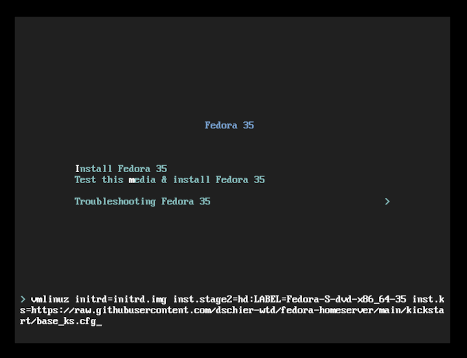

<!--
reference: https://www.makeareadme.com/
reference: https://commonmark.org/
-->

[](https://cirrus-ci.com/github/dschier-wtd/fedora-homeserver)
[](https://github.com/dschier-wtd/fedora-homeserver/releases)
[](https://github.com/dschier-wtd/fedora-homeserver/issues)
[](https://github.com/dschier-wtd/fedora-homeserver/pulls)
[](https://github.com/dschier-wtd/fedora-homeserver/blob/main/LICENSE)

# Fedora Homeserver

Kickstart and Ansible setup of my homeserver.

## Motivation

I am running my homeserver for quite some time, but wanted to automate it for
a while now. Recently a friend reached out and asked me to provide some kind of
documentation. So, I created this repository and a
[blog series](https://blog.while-true-do.io/fedora-home-server-intro-concept/)
about it.

## Description

The description provided here, should be reproducible without any further
explanation, but it is expected, that you already have some knowledge, when it
comes to installing an operating system and using Ansible. In case, you want to
learn more about some of the used technologies and software, I reommend having a
look at the below list of articles and work your way from there.

- [Fedora - Home Server Series](https://blog.while-true-do.io/fedora-home-server-intro-concept/)
- [Kickstart - Getting Started](https://blog.while-true-do.io/kickstart-getting-started/)
- [Spotlight - Fedora Server](https://blog.while-true-do.io/spotlight-fedora-server/)
- [Git - Getting Started](https://blog.while-true-do.io/git-getting-started/)
- [Ansible - Getting Started](https://blog.while-true-do.io/ansible-getting-started/)
- [Podman - Getting Started](https://blog.while-true-do.io/podman-getting-started/)

After having the home server in place, you can also check out other guides, that
may give an idea how you can put some workload on your server.

- [Tag - Guide](https://blog.while-true-do.io/tag/guide/)

### Requirements

For testing purposes, you need an x86_64 machine/virtual machine with at least
the below specifications:

- CPU: Intel Core CPU with 2 Cores
- Memory: 2 GB
- Disk: 20 GB
- Network: 1 Gb LAN

For a production setup, the below specifications are recommended:

- CPU: Intel Core CPU with 4 Cores
- Memory: 4 GB
- Disk: 200 GB
- Network: 1 Gb LAN

### Preparation

Before you can start with the installation, you need to download the Fedora
Server Netinstll image from the
[website](https://getfedora.org/en/server/download/) and create an USB media.

You can use the
[Fedora Media Writer](https://flathub.org/apps/details/org.fedoraproject.MediaWriter)
and/or follow the
[detailed instructions](https://docs.fedoraproject.org/en-US/quick-docs/creating-and-using-a-live-installation-image/).

Fedora Media Writer is also available for Windows and MacOS.

### OS Installation

I am using [Kickstart](https://pykickstart.readthedocs.io/en/latest/) for the
initial deployment of my homeserver. Kickstart automates all the steps needed in
the installer and you can also provide additional packages, scripts and files.

There are 2 Kickstart files in this repository:

- [base_ks.cfg](./kickstart/base_ks.cfg) is a general home server setup, that
  can be used in a VM for testing purposes.
- [full_ks.cfg](./kickstart/full_ks.cfg) is the automation I am using for my
  personal setup. The configuration takes care of customized partitioning,
  password settings and some additional configuration.

For this guide, I will stick to the [base_ks.cfg](./kickstart/base_ks.cfg), but
feel free to check out the other one, too. The installation will do the below
steps for you.

1. Create a user and password
2. Partition disk 1
3. Set the timezone to UTC
4. Set the keyboard layout to US
5. Set the language to en_US
6. Install packages
   - core
   - Cockpit
   - Ansible

Starting an installation via Kickstart is pretty easy:

1. Boot from USB media
2. At the below screenshot, interrupt the boot sequence by hitting a key and
   editing the first entry.
3. Add `inst.ks=https://your.kickstart.url/path/to/ks.cfg` like shown below:
   
4. Continue and the installer will do its work.
   
5. Wait until the system is rebooted and login with the default credentials.
   - **user: admin**
   - **pass: password**

After the succesful installation, you can configure the machine and install
additional software via Ansible as explained in the next section.

### Customization

Customizing the Ansible Playbook behavior can be done with the
[manifest.yml](./ansible/manifest.yml) in the repository. Just change it to
your liking and run the playbook as described in the above sections. Each
option is documented in the "manifest.yml".

### Configuration

The [Ansible Playbook "configure.yml"](./ansible/playbooks/configure.yml) can be
used on basically every Fedora Linux Server installation. It will:

- Configure the hostname and timezone
- Install and configure chrony (NTP)
- Install and configure some CLI tools
- Install and configure tuned (power profiles)

To apply the playbook, you just need to run it from your workstation.

```shell
# Run the playbook (dry-run)
$ ansible-playbook -i IP_ADDRESS, --check ansible/playbooks/homeserver.yml

# Run the playbook (for real)
$ ansible-playbook -i IP_ADDRESS, ansible/playbooks/homeserver.yml
```

### Update

Additionally, the [Ansible Playbook "update.yml"](./ansible/playbooks/update.yml)
can be used to keep your machine updated. It will:

- Update the system
- Reboot if necessary

You can apply it the same way as the "configure.yml" playbook.

```shell
# Run the playbook (dry-run)
$ ansible-playbook -i IP_ADDRESS, --check ansible/playbooks/homeserver.yml

# Run the playbook (for real)
$ ansible-playbook -i IP_ADDRESS, ansible/playbooks/homeserver.yml
```

I am not a fan of auto-updates (downloading updates is fine, though) and the
playbook will ensure that you can update and reboot whenever you feel
comfortable.

<!--

### Auto Configuration

The "configure.yml" playbook can be used as described above, but there is also
an option to apply each change in a repository automatically. This functionality
is known as
[ansible-pull](https://docs.ansible.com/ansible/latest/cli/ansible-pull.html).

You can opt-in to the behavior and the "configure.yml" will do these steps in
addition:

- install and configure ansible
- configure an ansible-pull systemd service
- configure an ansible-pull systemd timer

If this is done, systemd will execute ansible-pull on schedule. The changes will
be rolled out to the machine automatically.
-->

## License

Except otherwise noted, all work is [licensed](LICENSE) under a
[BSD-3-Clause License](https://opensource.org/licenses/BSD-3-Clause).

## Contact

Please feel free to reach out to me to provide feedback or get in touch.

- Site: <https://while-true-do.io>
- Blog: <https://blog.while-true-do.io>
- Code: <https://github.com/dschier-wtd>
- Mail: [dschier@while-true-do.io](mailto:dschier@while-true-do.io)
